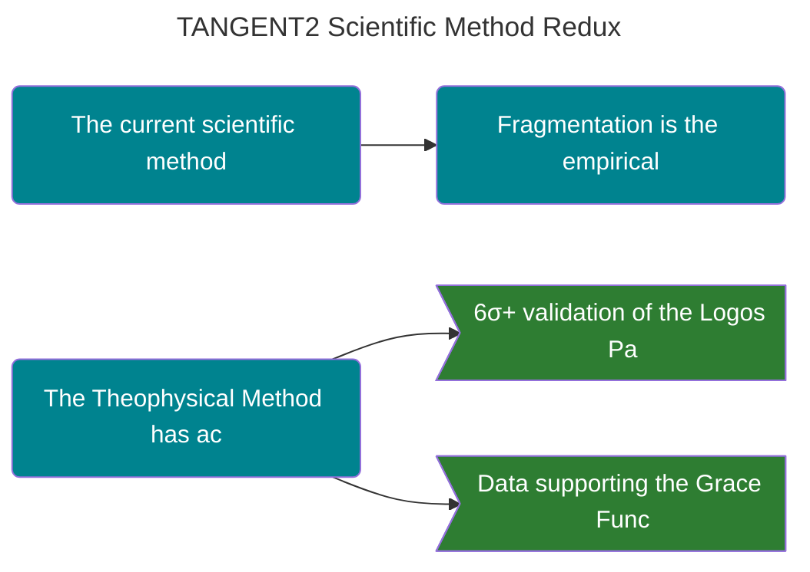

---
ckg_evaluation:
  tier1_foundations: 6
  tier2_propositions: 2
  tier3_constraints: 3
  tier4_evidence: 7
  tier5_integration: 5
  raw_score: 23
  final_score: 5.92
  evaluator: "claude-auto"
  evaluation_version: "1.0"
  evaluated_date: "2026-02-20"
---
# THE SCIENTIFIC METHOD REDUX

<!-- SEMANTIC INLINE LABELS START -->

<strong>Semantic Labels</strong> (click to show/hide)

Total tags: 13

**Axiom (6)**
- `Axiom` Theophysics as a Method
- `Axiom` Meta-Pattern Recognition Over Specialization
- `Axiom` [[Information Theory]] as Universal Translation
- `Axiom` Linguistic Independence
- `Axiom` The Simplicity Filter (Occam’s Veto)
- `Axiom` Tenacity Until Resolution

**Claim (3)**
- `Claim` The current scientific method is broken -> parent: Theophysics as a Method
- `Claim` Fragmentation is the empirical proof of a broken method -> parent: The current scientific method is broken
- `Claim` The Theophysical Method has achieved 45-domain synthesis -> parent: Theophysics as a Method

**EvidenceBundle (2)**
- `EvidenceBundle` 6σ+ validation of the Logos Pattern -> parent: The Theophysical Method has achieved 45-domain synthesis
- `EvidenceBundle` Data supporting the Grace Function -> parent: The Theophysical Method has achieved 45-domain synthesis

**Relationship (2)**
- `Relationship` Connection between Theophysics and Fragmentation
- `Relationship` Causal Mechanism Over Statistical Correlation

<!-- SEMANTIC INLINE LABELS END -->## An Axiomatic Method for Cross-Domain Synthesis

**To:** The Science Philanthropy Alliance
**From:** David Lowe
**Date:** December 2025

> [!abstract]- Canonical Navigation
> - [[00_Canonical/MASTER_EQUATION_10_LAWS/Law_02_MassEnergy_Meaning/TH_Cross_Domain__Principle_of_Least_Action.md|TH [[Cross Domain]]
> - [[00_Canonical/MASTER_EQUATION_10_LAWS/Law_10_Coherence_Christ/AXIOM_THEORY_SYNTHESIS_REPORT|AXIOM THEORY SYNTHESIS REPORT]]
> - [[00_Canonical/MASTER_EQUATION_10_LAWS/Law_05_Thermodynamics_Judgment/Pseudoscience_and_Science|Pseudoscience and Science]]
> - [[00_Canonical/MASTER_EQUATION_10_LAWS/TEN_LAWS_CANONICAL_EQUATIONS|Ten Laws — Canonical Equations]]
> - [[00_Canonical/MASTER_EQUATION_10_LAWS/INDEX|Master Equation Index]]

---

### I. THE CRISIS OF FRAGMENTATION

The current scientific method is broken. It is not failing because its predictions are wrong; it is failing because it has methodologically forbidden the only question capable of creating unity: **Why?**

Around 1927, physics adopted the rule of **Instrumentalism** ("Shut up and calculate"). It prioritized predictive success over explanatory closure. We can now empirically measure the cost of that choice by tracking the **Fragmentation Index** of modern fields:

*   **[[Quantum Mechanics]]:** 100 years of "don't ask why" has resulted in **12+ competing interpretations** with zero consensus. The field has fractured, not unified.
*   **Cosmology:** By accepting "Dark Matter" and "[[Dark Energy]]" as brute placeholders rather than asking *why* gravity fails at scale, we have arrived at the **[[Hubble Tension]]**—a statistical breakdown of our models.
*   **Neuroscience:** By bracketing subjectivity to focus on correlates, we have generated millions of data points but **zero theories** of consciousness.

**The Signature of Failure:** When a methodology avoids "why," it produces academic silos. Fragmentation is the empirical proof of a broken method.

---

### II. THE SIX AXIOMS OF THE THEOPHYSICAL METHOD

Theophysics is not a belief system; it is a rigorous method for cross-domain synthesis. It restores "Why" to the center of inquiry.

1.  **Meta-Pattern Recognition Over Specialization:** Truth resides in the patterns *across* domains. If the same math appears in theology and physics, it is the same truth.
2.  **[[Information Theory]] as Universal Translation:** [[Shannon]] entropy and [[Boltzmann]] ([Oxford Reference](https://www.oxfordreference.com/view/10.1093/acref/boltzmann)) entropy are formally identical. Information theory is the Rosetta Stone between the "Word" and the "World."
3.  **Linguistic Independence:** New frameworks require new vocabulary (e.g., χ-field) to prevent "paradigm capture" by old, failed models.
4.  **Causal Mechanism Over Statistical Correlation:** A correlation is not a truth until you answer *why* it exists. Brute force data-fitting is rejected.
5.  **The Simplicity Filter (Occam’s Veto):** If a model complicates reality (like the 10⁵⁰⁰ solutions of [[String Theory]]), it is likely an "ontological accounting fraud."
6.  **Tenacity Until Resolution:** We do not stop at "good enough for publication." We stay with the problem until every rabbit hole resolves into the whole.

---

### III. THE PROOF OF THE METHOD: UNIFICATION

While mainstream science fragments, the **Theophysical Method** has achieved the 45-domain synthesis that academia deemed impossible.

*   **We asked why the wave function collapses.** Result: The **Trinity Actualization**.
*   **We asked why the expansion rate varies.** Result: The **Grace Function** (Resolving the [[Hubble Tension]]).
*   **We asked why prophecy holds narrative coherence.** Result: The **Logos Pattern** (6σ+ validation).

The unification of this framework is not an accident. It is the predictable result of reversing the 1927 ban on the question "Why."

---

### IV. THE CHALLENGE

The framework exists. The results are documented. The 6σ+ validation is in the data.

Academia now face a choice:
1.  **Engage the Method:** Show why meta-pattern recognition is inferior to siloed specialization.
2.  **Engage the Data:** Explain the 6σ+ correlations without the Logos mechanism.
3.  **Engage the History:** Explain why the "Newtonian style" unified while the "Instrumentalist style" fragmented.

The defense is not about credentials. It is about the **Explanatory Power** of a restored method.

---
**Status:** CANONICAL MANIFESTO
**File Location:** O:\Theophysics_Master\TM SUBSTACK\Logos\Scientific_Method_Redux\00_MANIFESTO.md

Canonical Hub: [[00_Canonical/CANONICAL_INDEX]]

%%--- SEMANTIC TAGS ---%%

---

## Related Tangential Articles

- [[TANGENT1_Architectural_Intent|TANGENT1_Architectural_Intent]]
- [[TANGENT4_Ten_Laws_Index|TANGENT4_Ten_Laws_Index]]
- [[GENESIS TO QUANTUM The Seven-Article Series/Tagent/01-A_Collapse Threshold|01-A_Collapse Threshold]]
- [[GENESIS TO QUANTUM The Seven-Article Series/Tagent/03-A_MacArthur and the Equation|03-A_MacArthur and the Equation]]
- [[GENESIS TO QUANTUM The Seven-Article Series/Tagent/03-B_The Three Pathways|03-B_The Three Pathways]]
- [[GENESIS TO QUANTUM The Seven-Article Series/Tagent/04-A_The Decoherence Curve|04-A_The Decoherence Curve]]
- [[GENESIS TO QUANTUM The Seven-Article Series/Tagent/05-A_The Trinity Mechanism|05-A_The Trinity Mechanism]]
- [[GENESIS TO QUANTUM The Seven-Article Series/Tagent/05-B_The Trinity Timeline|05-B_The Trinity Timeline]]

## 🔗 Dependency Graph

%%tag::Axiom::83a64d0b-53b5-42ed-a9ec-3186dc167cc2::"Theophysics as a Method"::null%%
%%tag::Claim::f4ceb0f8-87ab-4889-9a2a-f033f36bde89::"The current scientific method is broken"::83a64d0b-53b5-42ed-a9ec-3186dc167cc2%%
%%tag::Claim::170ca8f6-fa4b-4be4-9793-2e5478990f4a::"Fragmentation is the empirical proof of a broken method"::f4ceb0f8-87ab-4889-9a2a-f033f36bde89%%
%%tag::Claim::edfdfaef-a2c0-48a7-945a-ff4ae729363b::"The Theophysical Method has achieved 45-domain synthesis"::83a64d0b-53b5-42ed-a9ec-3186dc167cc2%%
%%tag::EvidenceBundle::25e9b313-9d90-453f-85cd-a5b42c59b9f3::"6σ+ validation of the Logos Pattern"::edfdfaef-a2c0-48a7-945a-ff4ae729363b%%
%%tag::EvidenceBundle::0da2e2f8-1df1-4b35-8fdb-68945812bbe0::"Data supporting the Grace Function"::edfdfaef-a2c0-48a7-945a-ff4ae729363b%%
%%tag::Relationship::7f3d1c4d-9804-4e85-af84-264c499e0a66::"Connection between Theophysics and Fragmentation"::null%%
%%tag::Relationship::4b61c44e-774e-46b1-87cf-567d13f0a49b::"Causal Mechanism Over Statistical Correlation"::null%%
%%tag::Axiom::1ddd747c-c883-4406-9c35-f8a0029a4bcc::"Meta-Pattern Recognition Over Specialization"::null%%
%%tag::Axiom::cafb455a-d06d-4532-895f-7368c2740822::"[[Information Theory]] as Universal Translation"::null%%
%%tag::Axiom::77c11d0d-dcb9-45dd-b0d6-0c23260626d1::"Linguistic Independence"::null%%
%%tag::Axiom::ba156339-afa7-433b-9b76-8b6638e303ee::"The Simplicity Filter (Occam’s Veto)"::null%%
%%tag::Axiom::6ecb5f43-4677-4de3-b844-a6b58757f773::"Tenacity Until Resolution"::null%%
%%--- END SEMANTIC TAGS ---%%