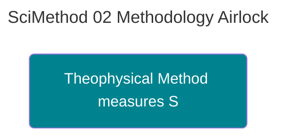

---
ckg_evaluation:
  tier1_foundations: 2
  tier2_propositions: 0
  tier3_constraints: 0
  tier4_evidence: 7
  tier5_integration: 7
  raw_score: 16
  final_score: 5.64
  evaluator: "claude-auto"
  evaluation_version: "1.0"
  evaluated_date: "2026-02-20"
---
# METHODOLOGY DEFENSE (THE AIRLOCK)

<!-- SEMANTIC INLINE LABELS START -->

<strong>Semantic Labels</strong> (click to show/hide)

Total tags: 11

**Axiom (1)**
- `Axiom` Irreducible Primitives

**Claim (7)**
- `Claim` Theophysical Method measures Systemic Crash -> parent: Irreducible Primitives
- `Claim` Trust Loss is measurable by rising Transaction Costs
- `Claim` Dishonesty is measurable by rising Prediction Error
- `Claim` Betrayal is measurable by collapse of Social Capital
- `Claim` You do not need to believe in 'Sin' to measure 'Social Entropy'
- `Claim` Theophysics is the science of the Shadow
- `Claim` Moral deviations have physical consequences

**EvidenceBundle (1)**
- `EvidenceBundle` Patterns of instability in human systems

**Relationship (2)**
- `Relationship` The relationship between moral deviations and physical consequences
- `Relationship` Connection between Love and Systemic Health

<!-- SEMANTIC INLINE LABELS END -->## How to Defend Theophysics to a Hostile Academic Reviewer

> **Strategic Note:** When presenting to academics, lead with **Systemic Consequences**, not **Metaphysical Primitives**. This document is the "Airlock" that scrubs the theology down into "Safe Science" for initial entry.

> [!abstract]- Canonical Navigation
> - [[00_Canonical/MASTER_EQUATION_10_LAWS/Law_10_Coherence_Christ/Logos_Theology|Logos Theology]]
> - [[00_Canonical/MASTER_EQUATION_10_LAWS/Law_05_Thermodynamics_Judgment/Pseudoscience_and_Science|Pseudoscience and Science]]
> - [[00_Canonical/TH_Physics/Quantum_Mechanics/Quantum_Information_Science|Quantum Information Science]]
> - [[00_Canonical/MASTER_EQUATION_10_LAWS/TEN_LAWS_CANONICAL_EQUATIONS|Ten Laws — Canonical Equations]]
> - [[00_Canonical/MASTER_EQUATION_10_LAWS/INDEX|Master Equation Index]]

---

### 1. THE DIAGNOSTIC STANCE (R5.0)
We do not quantify "Love" or "Grace." We treat them as **Irreducible Primitives**. However, while the *source* is irreducible, the **Downstream Signatures** are measurable.

*   **Standard Method:** "Define Love so we can measure it." (This fails).
*   **Theophysical Method:** "Measure the Systemic Crash that occurs when Love is absent." (This works).

### 2. MEASURING THE CRASH
The framework examines measurable patterns of instability in human systems:
*   **Trust Loss** $\rightarrow$ Measured by rising Transaction Costs and litigation.
*   **Dishonesty** $\rightarrow$ Measured by rising Prediction Error in social models.
*   **Betrayal** $\rightarrow$ Measured by the collapse of Social Capital and Institutional Fragility.

**The Argument:** You do not need to believe in "Sin" to measure "Social Entropy." We are simply using traditional moral categories as high-order variables for Systemic Health.

### 3. THE ASYMMETRY PRINCIPLE
You cannot measure the "Light" (God/Logos) directly with a physical ruler. But you can measure the **Shadow** (Entropy/Noise) cast by its absence. 
*   **Theophysics is the science of the Shadow.** 
*   It tracks the physical and informational costs of rejecting the Logos.

### 4. REBUTTING THE "CATEGORY ERROR" CHARGE
Critics will say: "You are turning ethics into engineering."
**Rebuttal:** "No. We are acknowledging that the Universe is an **Integrated System**. If the underlying structure is Moral (The Logos), then moral deviations *must* have physical consequences. We are simply following the data to where the consequences live."

---
**Status:** DIPLOMATIC PROTOCOL
**File Location:** O:\Theophysics_Master\TM SUBSTACK\Logos\Scientific_Method_Redux\02_METHODOLOGY_AIRLOCK.md

Canonical Hub: [[00_Canonical/CANONICAL_INDEX]]

%%--- SEMANTIC TAGS ---%%

---

## 🔗 Dependency Graph

%%tag::Axiom::4e7ee089-10f4-454a-918e-9c7c372bdb4b::"Irreducible Primitives"::null%%
%%tag::Claim::8c51acca-fc61-4e53-a647-041b2fb1a977::"Theophysical Method measures Systemic Crash"::4e7ee089-10f4-454a-918e-9c7c372bdb4b%%
%%tag::Claim::88121f5e-31c7-481e-9131-a439e3e401ac::"Trust Loss is measurable by rising Transaction Costs"::null%%
%%tag::Claim::8712fdd2-c21f-4018-9962-ce28eb278fd4::"Dishonesty is measurable by rising Prediction Error"::null%%
%%tag::Claim::214bd613-a5cb-4088-8633-2b9cb2095ef8::"Betrayal is measurable by collapse of Social Capital"::null%%
%%tag::Claim::72344e14-6217-44fb-8039-41ab3091c4f1::"You do not need to believe in 'Sin' to measure 'Social Entropy'"::null%%
%%tag::Claim::d4ae914c-13a7-48d5-92c4-72e592703db6::"Theophysics is the science of the Shadow"::null%%
%%tag::Claim::403fd227-0dd8-46f7-805f-1b7014d5c416::"Moral deviations have physical consequences"::null%%
%%tag::EvidenceBundle::62d110c5-a422-4345-bd77-eabff8c53a27::"Patterns of instability in human systems"::null%%
%%tag::Relationship::c6dec6e7-dfbf-4dbe-b75b-b0eb299a7a9f::"The relationship between moral deviations and physical consequences"::null%%
%%tag::Relationship::2efa87d2-ba1d-4ca7-96fd-7f3891dac788::"Connection between Love and Systemic Health"::null%%
%%--- END SEMANTIC TAGS ---%%