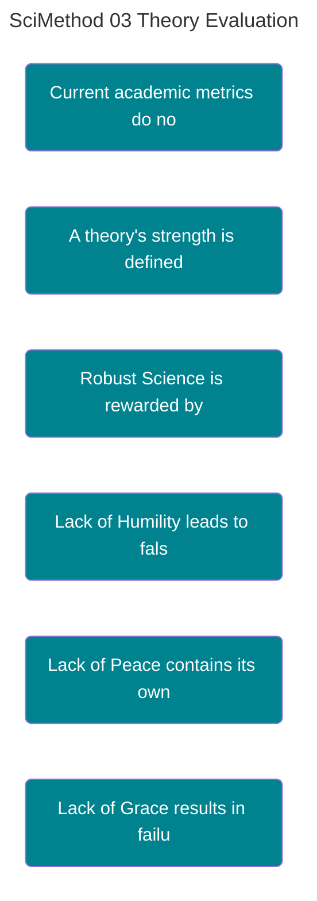

---
ckg_evaluation:
  tier1_foundations: 7
  tier2_propositions: 7
  tier3_constraints: 5
  tier4_evidence: 8
  tier5_integration: 6
  raw_score: 33
  final_score: 6.32
  evaluator: "claude-auto"
  evaluation_version: "1.0"
  evaluated_date: "2026-02-20"
---
# DEFENSE DEPTH AND STRUCTURAL COHERENCE

<!-- SEMANTIC INLINE LABELS START -->

<strong>Semantic Labels</strong> (click to show/hide)

Total tags: 13

**Axiom (2)**
- `Axiom` Survivability as a Metric
- `Axiom` Structural Properties for System Resilience

**Claim (8)**
- `Claim` Current academic metrics do not measure truth-survival capacity -> parent: Survivability as a Metric
- `Claim` A theory's strength is defined by its ability to absorb and resolve adversarial stress -> parent: Survivability as a Metric
- `Claim` High-Controversy Claims require High-Width Defense
- `Claim` UTDGS grades a theory based on its adversarial resilience
- `Claim` Robust Science is rewarded by UTDGS -> parent: UTDGS grades a theory based on its adversarial resilience
- `Claim` Lack of Humility leads to falsification -> parent: Structural Properties for System Resilience
- `Claim` Lack of Peace contains its own negation -> parent: Structural Properties for System Resilience
- `Claim` Lack of Grace results in failure with anomalies -> parent: Structural Properties for System Resilience

**Relationship (2)**
- `Relationship` Link between Defense Depth and Theory Strength
- `Relationship` Structural Invariants ensure system resilience

**primary (1)**
- `primary` Defense Depth Architecture

<!-- SEMANTIC INLINE LABELS END -->## New Metrics for Theory Evaluation in the Information Age

> **Abstract:** Current academic metrics (citation count, impact factor) measure popularity and gatekeeping, not truth-survival capacity. This paper proposes two complementary evaluation systems: **UTDGS (Universal Theory Defense Grading System)** for measuring horizontal defense depth, and **Structural Coherence Invariants** for measuring system survivability. We argue that a theory's strength is defined not by its acceptance, but by its ability to absorb and resolve adversarial stress.

> [!abstract]- Canonical Navigation
> - [[00_Canonical/MASTER_EQUATION_10_LAWS/Law_10_Coherence_Christ/Integrated_Information_Theory_(Tononi)|Integrated [[Information Theory]]
> - [[00_Canonical/MASTER_EQUATION_10_LAWS/Law_10_Coherence_Christ/Shannon_Information_Theory.md|[[Shannon Information]]
> - [[00_Canonical/MASTER_EQUATION_10_LAWS/Law_06_Information_Logos/Algorithmic_Information_Theory|Algorithmic Information Theory]]
> - [[00_Canonical/MASTER_EQUATION_10_LAWS/TEN_LAWS_CANONICAL_EQUATIONS|Ten Laws — Canonical Equations]]
> - [[00_Canonical/MASTER_EQUATION_10_LAWS/INDEX|Master Equation Index]]

---

## Part I: The Failure of Proxy Metrics

### 1.1 The Popularity Trap
Academia currently relies on proxies for truth:
*   **Citation Count** = Popularity. (Phlogiston was popular).
*   **Peer Review** = Consensus. (Galileo lacked consensus).
*   **H-Index** = Productivity. (Volume 

$\neq$

 Veracity).

**The Missing Metric:** None of these measure whether a theory can **survive sustained, high-coherence criticism**. A theory with 50,000 citations that collapses under one rigorous logical objection is structurally weak.

### 1.2 Defense Depth Architecture
A robust theory must do more than assert ($A \to B$). It must defend ($A \to B$ despite 

$C$

).
We propose a standard "Defense Width" metric:
1.  **Claim**
2.  **Objection** (Steelman)
3.  **Response** (Direct)
4.  **Grounds** (Deep Support)
5.  **Defeat Condition** (Falsifiability)

Current academic standards rarely require more than columns 1 and 2. We argue that **High-Controversy Claims require High-Width Defense**.

---

## Part II: The Universal Theory Defense Grading System (UTDGS)

### 2.1 The Metric
UTDGS grades a theory based on its adversarial resilience.
*   **Objection Anticipation (25%):** Does it pre-emptively identify its strongest critics?
*   **Response Strength (25%):** Does it resolve these objections without ad-hoc hypotheses?
*   **Evidence Depth (20%):** Does it ground claims in fundamental axioms rather than citations?
*   **Chain Completeness (15%):** Are the logical chains unbroken?
*   **Width Adequacy (15%):** Is the defense width proportional to the claim's boldness?

### 2.2 The Result
This metric penalizes "Safe Science" (low controversy, low defense) and "Dogmatic Science" (high controversy, zero defense). It rewards **"Robust Science"** (high controversy, high defense).

---

## Part III: Structural Coherence Invariants ("System Fruits")

### 3.1 Naming the Invariants
We identify 12 structural properties required for any system (biological, social, or theoretical) to resist entropy. While these align with classical "virtues," we define them here strictly as **Survival Constraints**.

| Invariant (Label) | System Function | Failure Mode |
|---|---|---|
| **Grace** | Error Absorption / Repair | Brittle collapse under stress |
| **Hope** | Non-Terminal Failure States | Systemic despair / Deadlock |
| **Patience** | Iterative Convergence | Premature optimization / Drift |
| **Faithfulness** | Signal Fidelity over Time | Drift / Corruption |
| **Self-Control** | Scope Bounding | Totalizing / Unfalsifiable |
| **Love** | Positive-Sum Orientation | Parasitic / Zero-Sum collapse |
| **Peace** | Internal Consistency | Logical Contradiction |
| **Truth** | Signal-to-Reality Match | Delusion / Hallucination |
| **Humility** | Update Capacity | Dogmatic Calcification |
| **Goodness** | Generative Surplus | Entropic Decay |
| **Unity** | Integration | Fragmentation / Siloing |
| **Joy** | Positive Feedback / Resonance | Burnout / Apathy |

### 3.2 The Argument
A theory that lacks **Humility** (Update Capacity) will eventually be falsified by new data it cannot integrate.
A theory that lacks **Peace** (Consistency) contains its own negation.
A theory that lacks **Grace** (Error Absorption) dies with its first anomaly.

Therefore, these are not "values." They are **physics**. They are the requirements for informational persistence.

---

## Part IV: Proposal for Implementation

We propose that journals and funding bodies adopt **Defense Depth** as a primary evaluation criterion.
*   **Require** explicit "[Defeat Conditions](https://www.oxfordreference.com/view/10.1093/acref/defeat+conditions)" for all major claims.
*   **Penalize** theories that ignore steelmanned objections.
*   **Audit** frameworks for Structural Invariants (e.g., does this model allow for update/repair?).

By shifting from "Popularity" to "Survivability," we align academic incentives with the pursuit of durable truth.

---
**Status:** METHODOLOGY PROPOSAL
**File Location:** O:\Theophysics_Master\TM SUBSTACK\03_PUBLICATIONS\Scientific method\03_METRICS_Theory_Evaluation.md

Canonical Hub: [[00_Canonical/CANONICAL_INDEX]]

%%--- SEMANTIC TAGS ---%%

---

## 🔗 Dependency Graph

%%tag::Axiom::3fa4ec35-2471-4b42-ac88-cb610c739d7d::"Survivability as a Metric"::null%%
%%tag::Claim::9a3fc755-ee92-4407-b2b0-310c09df5ab3::"Current academic metrics do not measure truth-survival capacity"::3fa4ec35-2471-4b42-ac88-cb610c739d7d%%
%%tag::Claim::190b8694-d927-4c29-935f-4454b028a85a::"A theory's strength is defined by its ability to absorb and resolve adversarial stress"::3fa4ec35-2471-4b42-ac88-cb610c739d7d%%
%%tag::Claim::95fdcdd4-ad53-47af-9aae-5f68819e832d::"High-Controversy Claims require High-Width Defense"::null%%
%%tag::primary::ab12463e-8aa5-4e8e-bb04-8ed6efe59a11::"Defense Depth Architecture"::null%%
%%tag::Claim::2f49ab5d-e989-4497-930f-227d61a28c79::"UTDGS grades a theory based on its adversarial resilience"::null%%
%%tag::Claim::d3c5e9cc-3fb4-4bc7-ada1-9c529d56266c::"Robust Science is rewarded by UTDGS"::2f49ab5d-e989-4497-930f-227d61a28c79%%
%%tag::Axiom::76b3f147-3bbd-4dd4-9c63-7b375254ba1b::"Structural Properties for System Resilience"::null%%
%%tag::Claim::f4d508c6-cc4e-433b-bcd6-7179b43e7386::"Lack of Humility leads to falsification"::76b3f147-3bbd-4dd4-9c63-7b375254ba1b%%
%%tag::Claim::09c0cb1f-7e72-4f12-9ebc-e62a305c6e47::"Lack of Peace contains its own negation"::76b3f147-3bbd-4dd4-9c63-7b375254ba1b%%
%%tag::Claim::16db8c1e-21b3-4857-a9fd-5fdba5981d22::"Lack of Grace results in failure with anomalies"::76b3f147-3bbd-4dd4-9c63-7b375254ba1b%%
%%tag::Relationship::c012102e-e47b-44c6-8c5b-6d394a1157b2::"Link between Defense Depth and Theory Strength"::null%%
%%tag::Relationship::60c2ef74-59ad-4fa4-8da1-572855e555c1::"Structural Invariants ensure system resilience"::null%%
%%--- END SEMANTIC TAGS ---%%