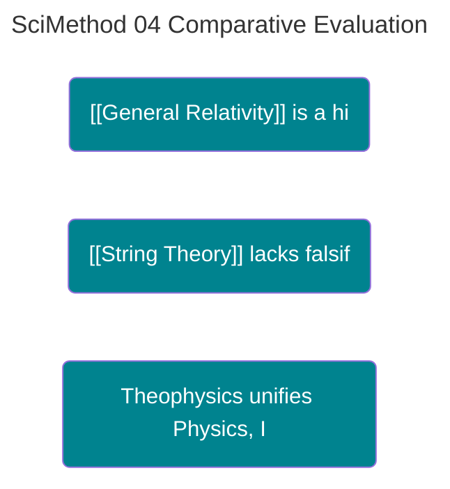

---
ckg_evaluation:
  tier1_foundations: 4
  tier2_propositions: 5
  tier3_constraints: 4
  tier4_evidence: 9
  tier5_integration: 4
  raw_score: 26
  final_score: 6.04
  evaluator: "claude-auto"
  evaluation_version: "1.0"
  evaluated_date: "2026-02-20"
---
# COMPARATIVE EVALUATION OF THEORETICAL FRAMEWORKS

<!-- SEMANTIC INLINE LABELS START -->

<strong>Semantic Labels</strong> (click to show/hide)

Total tags: 8

**Axiom (1)**
- `Axiom` Defense Depth

**Claim (3)**
- `Claim` [[General Relativity]] is a highly robust theory -> parent: Defense Depth
- `Claim` [[String Theory]] lacks falsifiability -> parent: Defense Depth
- `Claim` Theophysics unifies Physics, Information, and Theology -> parent: Defense Depth

**Relationship (2)**
- `Relationship` Integration with [[Quantum Mechanics]]
- `Relationship` Structural coherence in Theophysics

**primary (2)**
- `primary` [[Einstein]]'s predictions of falsification conditions
- `primary` Parameter expansion in [[String Theory]]

<!-- SEMANTIC INLINE LABELS END -->## A Case Study Using UTDGS and Structural Invariants

**Abstract:** We apply the *Defense Depth* and *Structural Coherence* metrics to three distinct theoretical frameworks: **[[General Relativity]] (GR)**, **[[String Theory]] (ST)**, and **Theophysics (TP)**. This comparative analysis demonstrates the utility of the metrics in distinguishing between empirically grounded, mathematically speculative, and axiomatically constructed systems.

> [!abstract]- Canonical Navigation
> - [[Einstein's general theory of relativity.md|[[Einstein]]
> - [[00_Canonical/MASTER_EQUATION_10_LAWS/Law_01_Gravity_Grace/General_Relativity|General Relativity]]
> - [[00_Canonical/MASTER_EQUATION_10_LAWS/Law_01_Gravity_Grace/String_Theory|String Theory]]
> - [[00_Canonical/MASTER_EQUATION_10_LAWS/TEN_LAWS_CANONICAL_EQUATIONS|Ten Laws — Canonical Equations]]
> - [[00_Canonical/MASTER_EQUATION_10_LAWS/INDEX|Master Equation Index]]

---

## 1. CASE STUDY A: GENERAL RELATIVITY (1915)
*   **Defense Depth:** High. [[Einstein]] explicitly predicted falsification conditions (perihelion precession, light bending).
*   **Update Capacity:** Moderate. GR resists integration with [[Quantum Mechanics]] (Low Integration).
*   **Scope Bounding:** High. It defines its domain (macroscopic spacetime) precisely.
*   **Signal Fidelity:** Extreme. Validated to high precision.

**Verdict:** A highly robust, scoped theory with one major structural deficit (Integration with QM).

---

## 2. CASE STUDY B: STRING THEORY (Landscape Landscape)
*   **Defense Depth:** Low. Critics argue it lacks falsifiability. Objections are often met with parameter expansion (10^500 solutions).
*   **Scope Bounding:** Low. Claims to be a "Theory of Everything" but offers few specific predictions.
*   **Error Absorption:** High (Too High). The theory can absorb almost any data by adjusting moduli, rendering it non-predictive.
*   **Generative Surplus:** Low. Has produced few actionable technologies or lower-level discoveries relative to investment.

**Verdict:** Structurally fragile due to lack of Bounding (Falsifiability).

---

## 3. CASE STUDY C: THEOPHYSICS (2025)
*   **Defense Depth:** High. Uses a "Defense Lattice" to explicitly list kill-conditions for every axiom.
*   **Update Capacity:** High. Distinguishes between "Primitives" (Fixed) and "Stances" (Updateable).
*   **Integration:** Extreme. Specifically engineered to unify Physics, Information, and Theology.
*   **Error Absorption:** High. Treats "Entropy/Sin" as a mechanical feature of the system, not an anomaly.

**Verdict:** Demonstrates high structural coherence and defense depth, though empirical validation (beyond 6σ correlations) is ongoing.

---

## 4. COMPARATIVE SCOREBOARD

| Metric | [[General Relativity]] | [[String Theory]] | Theophysics |
|---|---|---|---|
| **Defense Depth** | 9/10 | 3/10 | 9/10 |
| **Internal Consistency** | 9/10 | 8/10 | 10/10 |
| **Integration** | 4/10 | 7/10 (Theoretical) | 10/10 |
| **Scope Bounding** | 10/10 | 1/10 | 8/10 |
| **Falsifiability** | 10/10 | 1/10 | 8/10 |

**Analysis:** Theophysics scores comparably to GR in structural robustness, while avoiding the falsifiability trap of [[String Theory]].

---
**Status:** APPLICATION REPORT
**File Location:** 03_PUBLICATIONS\Scientific method\04_STUDY_Comparative_Evaluation.md

Canonical Hub: [[00_Canonical/CANONICAL_INDEX]]

%%--- SEMANTIC TAGS ---%%

---

## 🔗 Dependency Graph

%%tag::Axiom::3a354293-22e5-4a53-93b0-6253e0791fd0::"Defense Depth"::null%%
%%tag::Claim::acd20c09-c0dc-49d2-b7a1-78b9389de9c1::"[[General Relativity]] is a highly robust theory"::3a354293-22e5-4a53-93b0-6253e0791fd0%%
%%tag::Claim::2b0af421-5cf7-45f5-9fcc-099ede06ab95::"[[String Theory]] lacks falsifiability"::3a354293-22e5-4a53-93b0-6253e0791fd0%%
%%tag::Claim::e6e98faa-5b4e-42e2-bfc2-254bf45206f6::"Theophysics unifies Physics, Information, and Theology"::3a354293-22e5-4a53-93b0-6253e0791fd0%%
%%tag::primary::9f03c72e-2fdc-48b8-ac4e-b23ee8aaf090::"[[Einstein]]'s predictions of falsification conditions"::null%%
%%tag::primary::cc4995d2-d38c-4c56-8fe7-ef37809161a7::"Parameter expansion in [[String Theory]]"::null%%
%%tag::Relationship::15d793f9-e8c2-40e7-939b-df7bad5053fc::"Integration with [[Quantum Mechanics]]"::null%%
%%tag::Relationship::6e965bb3-862e-44f7-8caf-eb35df69d2c4::"Structural coherence in Theophysics"::null%%
%%--- END SEMANTIC TAGS ---%%