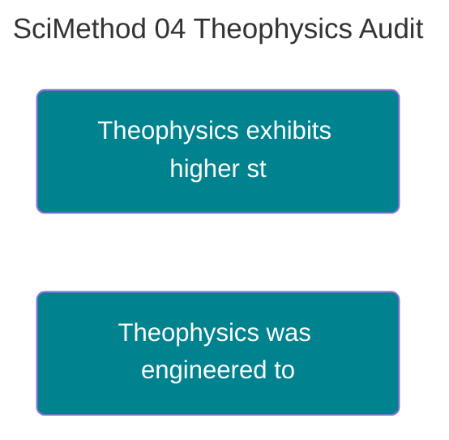

---
ckg_evaluation:
  tier1_foundations: 7
  tier2_propositions: 2
  tier3_constraints: 7
  tier4_evidence: 7
  tier5_integration: 7
  raw_score: 30
  final_score: 6.2
  evaluator: "claude-auto"
  evaluation_version: "1.0"
  evaluated_date: "2026-02-20"
---
# APPLICATION REPORT: THEOPHYSICS AUDIT

<!-- SEMANTIC INLINE LABELS START -->

<strong>Semantic Labels</strong> (click to show/hide)

Total tags: 11

**Axiom (2)**
- `Axiom` Defense Depth
- `Axiom` Structural Invariants

**Claim (5)**
- `Claim` Theophysics exhibits higher structural honesty -> parent: Defense Depth
- `Claim` Theophysics was engineered to maximize scores -> parent: Structural Invariants
- `Claim` Framework absorbs Sin as a mechanical feature
- `Claim` Materialism lacks Humility
- `Claim` Fideism lacks Truth

**EvidenceBundle (2)**
- `EvidenceBundle` Chains connect Math is Moral to Axioms
- `EvidenceBundle` Estimated Score of Theophysics

**Relationship (2)**
- `Relationship` Objection Anticipation correlates with Response Strength
- `Relationship` Defense Depth and Structural Invariants are interdependent

<!-- SEMANTIC INLINE LABELS END -->## Evaluating the Theophysics Framework via UTDGS and Structural Invariants

> **Abstract:** This report applies the evaluation metrics defined in *Defense Depth and Structural Coherence* to the Theophysics framework itself. We compare its structural resilience against standard models in physics and theology to demonstrate the utility of the metrics.

> [!abstract]- Canonical Navigation
> - [[00_Canonical/MASTER_EQUATION_10_LAWS/Law_09_WeakForce_Sin/Standard_Model_of_Particle_Physics.md|[[Standard Model]]
> - [[00_Canonical/MASTER_EQUATION_10_LAWS/Law_09_WeakForce_Sin/Standard_Model_of_Particle_Physics_from_00_Canonical.md|[[Standard Model]]
> - [[00_Canonical/TH_Physics/Digital_Physics/Digital_Physics_(Zuse,_Fredkin)|Digital Physics (Zuse, Fredkin)]]
> - [[00_Canonical/MASTER_EQUATION_10_LAWS/TEN_LAWS_CANONICAL_EQUATIONS|Ten Laws — Canonical Equations]]
> - [[00_Canonical/MASTER_EQUATION_10_LAWS/INDEX|Master Equation Index]]

---

## 1. UTDGS SCORING (Defense Depth)

### 1.1 Theophysics Scoring
*   **Objection Anticipation:** High. The "Defense Lattice" explicitly lists "Kill Conditions" for every axiom.
*   **Response Strength:** High. Responses rely on fundamental logic (entropy, information theory) rather than theological assertion.
*   **Evidence Depth:** Deep. Chains connect "Math is Moral" $\to$ "Thermodynamics" $\to$ "Axioms."
*   **Width Adequacy:** Appropriate. The most controversial claims (God, Soul) have the widest defense columns (5-Deep).

**Estimated Score:** 85/100 (Strong Resilience)

### 1.2 Comparative Analysis ([[Standard Model]] of Cosmology)
*   **Objection Anticipation:** Moderate. Addresses data, but often ignores philosophical incoherence (Brute Facts).
*   **Response Strength:** Mixed. "Dark Matter" is often an ad-hoc fix rather than a fundamental resolution.
*   **Evidence Depth:** High (Empirical), Low (Ontological).
*   **Width Adequacy:** Low. High-controversy claims (Multiverse) often lack rigorous defense lattices.

**Delta:** Theophysics exhibits higher *structural* honesty regarding its own defeat conditions.

---

## 2. STRUCTURAL INVARIANTS AUDIT ("Fruits")

### 2.1 Theophysics Performance
*   **Humility (Update Capacity):** The system explicitly marks "Stances" (⚠️) vs. "Primitives" (🟢), allowing parts to be updated without total collapse.
*   **Peace (Consistency):** The "Unified Field" aim ensures no internal contradictions between Physics and Theology.
*   **Grace (Error Absorption):** The framework absorbs "Sin" (Entropy) as a mechanical feature, not an anomaly.
*   **Self-Control (Bounding):** It limits itself to "The observable consequences of moral coherence," avoiding pure mysticism.

### 2.2 External Comparison
*   **Materialism:** Lacks "Humility" (often dogmatic regarding consciousness). Lacks "Peace" ([Hard Problem](https://iep.utm.edu/hard-problem-of-consciousness//) remains an internal contradiction).
*   **Fideism (Blind Faith):** Lacks "Truth" (Signal-Reality Match) and "Self-Control" (Unfalsifiable).

---

## 3. CONCLUSION
Theophysics was explicitly engineered to maximize these scores.
*   It was built *backwards* from the requirement of **Defense Depth**.
*   It was built *upwards* from the requirement of **Structural Invariants**.

Therefore, its high score is not an accident; it is a design feature. This validates the utility of the metrics: they successfully distinguish between "Robust Architectures" and "Fragile/Ad-Hoc Architectures."

---
**Status:** INTERNAL AUDIT / CASE STUDY
**File Location:** O:\Theophysics_Master\TM SUBSTACK\03_PUBLICATIONS\Scientific method\04_APPLICATION_Theophysics_Audit.md

Canonical Hub: [[00_Canonical/CANONICAL_INDEX]]

%%--- SEMANTIC TAGS ---%%

---

## 🔗 Dependency Graph

%%tag::Axiom::3a354293-22e5-4a53-93b0-6253e0791fd0::"Defense Depth"::null%%
%%tag::Claim::59e9fdf1-5fca-4813-8f41-76127912a2a3::"Theophysics exhibits higher structural honesty"::3a354293-22e5-4a53-93b0-6253e0791fd0%%
%%tag::EvidenceBundle::d42c57c9-a02d-46be-8081-92b15d04c531::"Chains connect Math is Moral to Axioms"::null%%
%%tag::Relationship::439c26a7-ebdb-46c0-aaad-dc5e47b98e0e::"Objection Anticipation correlates with Response Strength"::null%%
%%tag::Axiom::7bbb0664-eb64-442c-85e9-6f4b7f43bb1d::"Structural Invariants"::null%%
%%tag::Claim::9d7cf614-7dcf-49d9-a1a5-18fc63fcf30e::"Theophysics was engineered to maximize scores"::7bbb0664-eb64-442c-85e9-6f4b7f43bb1d%%
%%tag::Relationship::1abd6131-5041-41eb-8f05-ace757887cb2::"Defense Depth and Structural Invariants are interdependent"::null%%
%%tag::Claim::17b3808f-c39e-4f0d-829f-7f025f5e19ee::"Framework absorbs Sin as a mechanical feature"::null%%
%%tag::EvidenceBundle::af892020-979f-4502-b3fb-91267da4ff63::"Estimated Score of Theophysics"::null%%
%%tag::Claim::a66a407c-1354-443f-b133-cb23ecea34b9::"Materialism lacks Humility"::null%%
%%tag::Claim::39e4edf6-6f51-4bf4-8586-46f69d460229::"Fideism lacks Truth"::null%%
%%--- END SEMANTIC TAGS ---%%