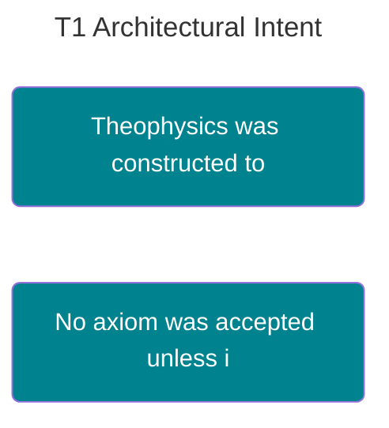

---
ckg_evaluation:
  tier1_foundations: 7
  tier2_propositions: 2
  tier3_constraints: 2
  tier4_evidence: 0
  tier5_integration: 5
  raw_score: 16
  final_score: 5.64
  evaluator: "claude-auto"
  evaluation_version: "1.0"
  evaluated_date: "2026-02-20"
---
# ARCHITECTURAL INTENT: THE DESIGN OF THEOPHYSICS

<!-- SEMANTIC INLINE LABELS START -->

<strong>Semantic Labels</strong> (click to show/hide)

Total tags: 11

**Axiom (2)**
- `Axiom` Defense Depth
- `Axiom` Systemic Integration

**Claim (5)**
- `Claim` Theophysics was constructed to maximize Defense Depth and Systemic Integration -> parent: Defense Depth
- `Claim` Theophysics was built Backward (Objection to Axiom)
- `Claim` No axiom was accepted unless it held true in both Physics and Theology -> parent: Systemic Integration
- `Claim` The framework defines 'Sin' as Systemic Noise
- `Claim` Grace is a Negentropic Operator required for system maintenance

**Relationship (3)**
- `Relationship` Axioms constructed to survive objections
- `Relationship` Unity between Physics and Theology
- `Relationship` Entropy and Grace as mechanisms for error absorption

**primary (1)**
- `primary` High performance on Structural Coherence metrics

<!-- SEMANTIC INLINE LABELS END -->## Why the Framework Scores High on Stability Metrics

**Abstract:** The high performance of the Theophysics framework on *Structural Coherence* metrics is not accidental. This document details the engineering decisions made to ensure the framework's survivability. We argue that Theophysics was explicitly constructed to maximize **Defense Depth** and **Systemic Integration**.

> [!abstract]- Canonical Navigation
> - [[00_Canonical/MASTER_EQUATION_10_LAWS/Law_10_Coherence_Christ/AXIOM_THEORY_SYNTHESIS_REPORT|AXIOM THEORY SYNTHESIS REPORT]]
> - [[00_Canonical/MASTER_EQUATION_10_LAWS/TEN_LAWS_CANONICAL_EQUATIONS|Ten Laws — Canonical Equations]]
> - [[00_Canonical/MASTER_EQUATION_10_LAWS/INDEX|Master Equation Index]]

---

## 1. DESIGNING FOR DEFENSE DEPTH
Most theories are built **Forward** (Observation $\to$ Hypothesis).
Theophysics was built **Backward** (Objection $\to$ Axiom).

*   **The Process:** We identified the strongest possible objections (Materialism, Nihilism, Theodicy) *first*.
*   **The Solution:** We constructed axioms (e.g., *Volitional Polarity*, *Semantic Necessity*) specifically to survive those objections.
*   **Result:** A "Defense Lattice" where every claim is pre-fortified.

## 2. DESIGNING FOR INTEGRATION (UNITY)
Standard academic methodology encourages siloing (Low Integration).
Theophysics adopted **"Meta-Pattern Recognition"** as its primary method.

*   **The Constraint:** No axiom was accepted unless it held true in *both* Physics and Theology.
*   **The Effect:** This forced the removal of "Magic" (from Theology) and "Brute Facts" (from Physics).
*   **Result:** A unified ontology where 

$\chi$

 (Logos) serves as the common substrate.

## 3. DESIGNING FOR ERROR ABSORPTION (GRACE)
Fragile theories collapse when they encounter error (Anomaly).
Theophysics internalizes error as **Entropy/Sin**.

*   **The Mechanism:** The framework defines "Sin" not as a rule-violation, but as **Systemic Noise**.
*   **The Repair:** It incorporates "Grace" not as a sentiment, but as a **Negentropic Operator** required for system maintenance.
*   **Result:** The theory anticipates failure modes and includes a mechanism for repair.

## 4. CONCLUSION
Theophysics scores high on stability metrics because it treats **Truth as a Survival Function**.
It is not merely a collection of ideas; it is a **Self-Correcting Architecture** designed to endure in a high-noise environment.

---
**Status:** SYNTHESIS PAPER
**File Location:** 03_PUBLICATIONS\Scientific method\05_SYNTHESIS_Architectural_Intent.md

Canonical Hub: [[00_Canonical/CANONICAL_INDEX]]

%%--- SEMANTIC TAGS ---%%

---

## 🔗 Dependency Graph

%%tag::Axiom::3a354293-22e5-4a53-93b0-6253e0791fd0::"Defense Depth"::null%%
%%tag::Axiom::0096c4b6-3f88-4f8a-b064-7353d650c49b::"Systemic Integration"::null%%
%%tag::Claim::fc5fb7ef-7028-4d5e-8972-ac65515fafeb::"Theophysics was constructed to maximize Defense Depth and Systemic Integration"::3a354293-22e5-4a53-93b0-6253e0791fd0%%
%%tag::Claim::04589151-cba0-44c2-8079-b12209e2423d::"Theophysics was built Backward (Objection to Axiom)"::null%%
%%tag::Claim::072171ac-f381-4f55-ad88-594974babfec::"No axiom was accepted unless it held true in both Physics and Theology"::0096c4b6-3f88-4f8a-b064-7353d650c49b%%
%%tag::Claim::f36c8a8b-0498-43b8-8a57-a4aacd2810c2::"The framework defines 'Sin' as Systemic Noise"::null%%
%%tag::Claim::b2bf9160-aa73-4a41-85c1-c4f6606c6842::"Grace is a Negentropic Operator required for system maintenance"::null%%
%%tag::primary::7d3c0f63-d0c4-48c5-8d23-6b6d98b8f2a5::"High performance on Structural Coherence metrics"::null%%
%%tag::Relationship::f9b5a06d-15b1-4d69-b5eb-cc7326bd8791::"Axioms constructed to survive objections"::null%%
%%tag::Relationship::5f280626-f013-40fa-b840-089674600791::"Unity between Physics and Theology"::null%%
%%tag::Relationship::14942e69-d4db-4840-b659-312acbbe059d::"Entropy and Grace as mechanisms for error absorption"::null%%
%%--- END SEMANTIC TAGS ---%%